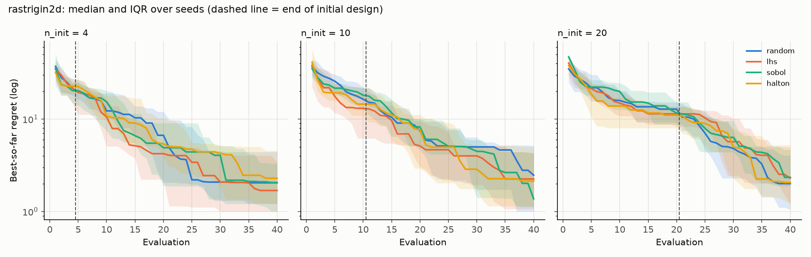
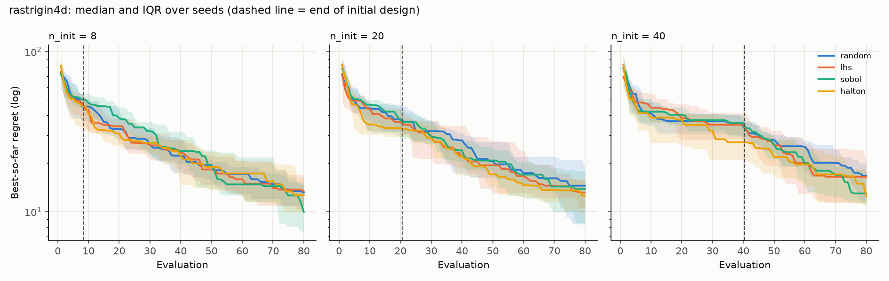
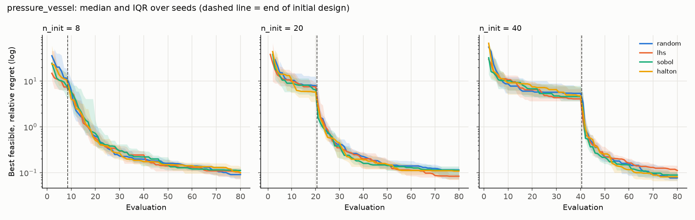
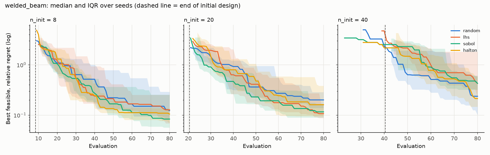

# Initial-design comparison: results

### rastrigin2d (d=2, budget=40, best known 0)

Final best feasible objective; median [25th, 75th percentile] over seeds. `p vs random` is a two-sided Mann-Whitney U test on the final values.

| n_init | design | seeds | after initial design | final | p vs random | runs feasible at end |
| ---: | :--- | ---: | :--- | :--- | ---: | ---: |
| 4 | random | 20 | 21.5 [18.1, 27.1] | 2.04 [1.21, 4.41] |  | 20/20 |
| 4 | lhs | 20 | 21.5 [14.8, 25] | 1.69 [0.998, 3.41] | 0.32 | 20/20 |
| 4 | sobol | 20 | 20.3 [14.9, 24.7] | 2.06 [1.01, 3.3] | 0.58 | 20/20 |
| 4 | halton | 20 | 22.7 [19, 27.3] | 2.29 [1.21, 4.55] | 0.51 | 20/20 |
| 10 | random | 20 | 16.4 [12.5, 22.1] | 2.47 [1, 5.13] |  | 20/20 |
| 10 | lhs | 20 | 13.1 [6.18, 21.7] | 2.25 [1.06, 4.26] | 0.86 | 20/20 |
| 10 | sobol | 20 | 18.1 [16.1, 21.7] | 1.37 [1.12, 4.28] | 0.68 | 20/20 |
| 10 | halton | 20 | 14.5 [10.9, 18.4] | 2.13 [1.14, 5.01] | 0.92 | 20/20 |
| 20 | random | 20 | 12.8 [9.2, 15.2] | 2 [1.05, 4.04] |  | 20/20 |
| 20 | lhs | 20 | 11.4 [8.29, 13.6] | 2.29 [1.19, 4.95] | 0.27 | 20/20 |
| 20 | sobol | 20 | 11.6 [8.75, 15.2] | 2.34 [1.88, 4.63] | 0.11 | 20/20 |
| 20 | halton | 20 | 11 [7.99, 13.7] | 2.06 [1.21, 5.23] | 0.36 | 20/20 |

### rastrigin4d (d=4, budget=80, best known 0)

Final best feasible objective; median [25th, 75th percentile] over seeds. `p vs random` is a two-sided Mann-Whitney U test on the final values.

| n_init | design | seeds | after initial design | final | p vs random | runs feasible at end |
| ---: | :--- | ---: | :--- | :--- | ---: | ---: |
| 8 | random | 20 | 45.3 [37.3, 53.4] | 13.2 [10.8, 15] |  | 20/20 |
| 8 | lhs | 20 | 47.5 [34.9, 54.4] | 13.4 [10.3, 17.1] | 0.99 | 20/20 |
| 8 | sobol | 20 | 50.1 [43.9, 54.6] | 9.93 [7.54, 14.3] | 0.13 | 20/20 |
| 8 | halton | 20 | 45.8 [32.6, 49.2] | 12.7 [9.98, 16.3] | 0.76 | 20/20 |
| 20 | random | 20 | 37.7 [31.5, 46.5] | 14.5 [8.36, 18.8] |  | 20/20 |
| 20 | lhs | 20 | 36.4 [31.8, 43.7] | 13.2 [10.6, 15.6] | 0.71 | 20/20 |
| 20 | sobol | 20 | 37.3 [28.7, 44.1] | 13.8 [8.51, 17.9] | 0.74 | 20/20 |
| 20 | halton | 20 | 33.3 [29.3, 40.1] | 12.6 [9.86, 15.8] | 0.46 | 20/20 |
| 40 | random | 20 | 34 [28.6, 37.5] | 16.8 [11.8, 19.7] |  | 20/20 |
| 40 | lhs | 20 | 34.9 [28.3, 41.2] | 16.5 [11.4, 20.7] | 0.99 | 20/20 |
| 40 | sobol | 20 | 35.7 [29.6, 40.2] | 13 [11.1, 17.7] | 0.25 | 20/20 |
| 40 | halton | 20 | 27.1 [21.1, 34.3] | 12.5 [10.7, 18.6] | 0.44 | 20/20 |

### pressure_vessel (d=4, budget=80, best known 5885.33)

Final best feasible objective; median [25th, 75th percentile] over seeds. `p vs random` is a two-sided Mann-Whitney U test on the final values.

| n_init | design | seeds | after initial design | final | p vs random | runs feasible at end |
| ---: | :--- | ---: | :--- | :--- | ---: | ---: |
| 8 | random | 20 | 7.45e+04 [4.51e+04, 1.18e+05] | 6.42e+03 [6.33e+03, 6.51e+03] |  | 20/20 |
| 8 | lhs | 20 | 4.97e+04 [4.32e+04, 6.7e+04] | 6.47e+03 [6.31e+03, 6.58e+03] | 0.58 | 20/20 |
| 8 | sobol | 20 | 5.32e+04 [3.2e+04, 9.61e+04] | 6.54e+03 [6.51e+03, 6.63e+03] | 0.02 | 20/20 |
| 8 | halton | 20 | 6.89e+04 [4.92e+04, 9.26e+04] | 6.48e+03 [6.35e+03, 6.68e+03] | 0.38 | 20/20 |
| 20 | random | 20 | 5.27e+04 [4.12e+04, 7.99e+04] | 6.56e+03 [6.32e+03, 6.64e+03] |  | 20/20 |
| 20 | lhs | 20 | 5.01e+04 [3.84e+04, 5.96e+04] | 6.38e+03 [6.3e+03, 6.44e+03] | 0.06 | 20/20 |
| 20 | sobol | 20 | 4.4e+04 [3.34e+04, 5.7e+04] | 6.55e+03 [6.38e+03, 6.7e+03] | 0.81 | 20/20 |
| 20 | halton | 20 | 3.99e+04 [2.65e+04, 4.53e+04] | 6.52e+03 [6.3e+03, 6.56e+03] | 0.21 | 20/20 |
| 40 | random | 20 | 3.77e+04 [2.88e+04, 4.91e+04] | 6.34e+03 [6.28e+03, 6.5e+03] |  | 20/20 |
| 40 | lhs | 20 | 3e+04 [2.73e+04, 4.54e+04] | 6.54e+03 [6.31e+03, 6.72e+03] | 0.11 | 20/20 |
| 40 | sobol | 20 | 3.29e+04 [2.73e+04, 5.25e+04] | 6.41e+03 [6.34e+03, 6.49e+03] | 0.21 | 20/20 |
| 40 | halton | 20 | 3.39e+04 [3.05e+04, 4.95e+04] | 6.36e+03 [6.27e+03, 6.56e+03] | 0.95 | 20/20 |

### welded_beam (d=4, budget=80, best known 1.72485)

Final best feasible objective; median [25th, 75th percentile] over seeds. `p vs random` is a two-sided Mann-Whitney U test on the final values.

| n_init | design | seeds | after initial design | final | p vs random | runs feasible at end |
| ---: | :--- | ---: | :--- | :--- | ---: | ---: |
| 8 | random | 20 | ∞ [∞, ∞] | 1.94 [1.87, 2.22] |  | 20/20 |
| 8 | lhs | 20 | ∞ [∞, ∞] | 1.94 [1.84, 2.16] | 0.64 | 20/20 |
| 8 | sobol | 20 | ∞ [∞, ∞] | 1.87 [1.82, 2.16] | 0.10 | 20/20 |
| 8 | halton | 20 | ∞ [∞, ∞] | 1.91 [1.84, 1.96] | 0.23 | 20/20 |
| 20 | random | 20 | ∞ [5.13, ∞] | 2.07 [1.96, 2.22] |  | 20/20 |
| 20 | lhs | 20 | ∞ [5.99, ∞] | 1.91 [1.88, 2.01] | 0.03 | 20/20 |
| 20 | sobol | 20 | ∞ [6.37, ∞] | 1.92 [1.88, 2.01] | 0.01 | 20/20 |
| 20 | halton | 20 | ∞ [9.63, ∞] | 2 [1.89, 2.38] | 0.46 | 20/20 |
| 40 | random | 20 | 5.74 [4.79, ∞] | 2.13 [1.9, 2.78] |  | 20/20 |
| 40 | lhs | 20 | 9.87 [4.69, ∞] | 2.46 [2.12, 4.86] | 0.10 | 20/20 |
| 40 | sobol | 20 | 6.08 [5.09, ∞] | 2.46 [2.28, 2.73] | 0.13 | 20/20 |
| 40 | halton | 20 | 5.47 [4.23, ∞] | 2.09 [1.98, 2.77] | 0.82 | 20/20 |

